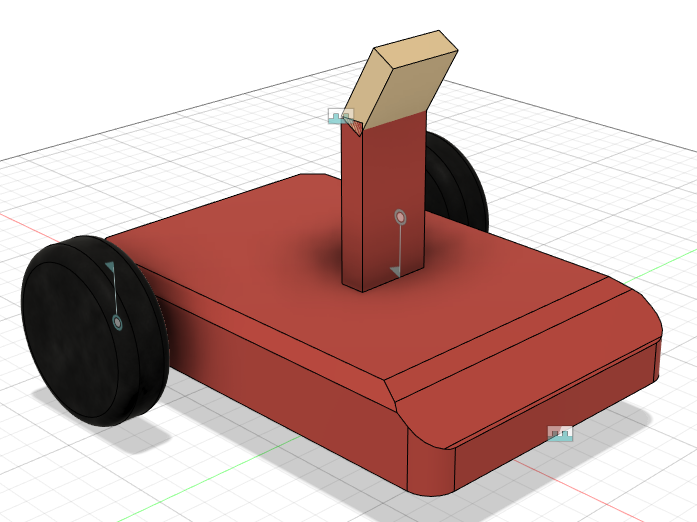
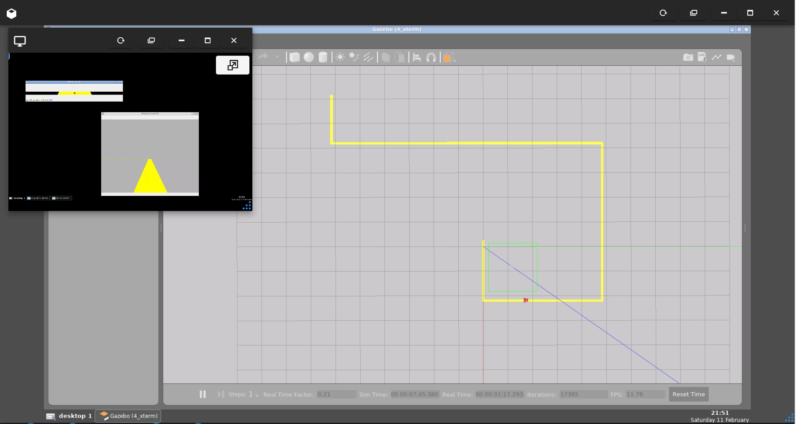
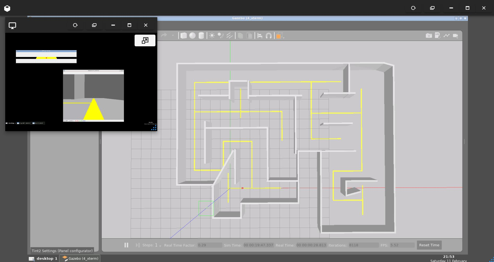

# maze_robot
## Line Follower and Maze Solver Robot Using OpenCV
<br>

&nbsp;

____________________________________________________________________________
# **Details About Project**

## Software Used
- Fusion360 -> For designing the 3D Model of the robot.
- [fusion2urdf](https://github.com/syuntoku14/fusion2urdf) -> Fusion360 script to export urdf from fusion 360 directly. 
- ROS (Robot Operating System) 
- Gazebo 
- Rviz 

Robot Drive Plugin Used - [Differential Drive - Gazebo](http://gazebosim.org/tutorials?tut=ros_gzplugins#DifferentialDrive)

## Fusion360 Model
<div align="center">

<br />
</div>

## Clone this repository inside your ROS Workspace:
```
cd ~/catkin_ws/src/
git clone https://github.com/nilutpolkashyap/maze_robot.git
cd ~/catkin_ws/
catkin_make
source devel/setup.bash
```

## A. Line Follower Robot
Type the command in a terminal to launch the Line follower world simulation:
```
roslaunch maze_robot_description line_follower.launch
```
Type the command in another terminal to run the line follower node:
```
rosrun maze_robot_solver line_follower.py
```
OUTPUT - 
<div align="center">

<br />
</div>


## B. Maze Solving Robot
Type the command in a terminal to launch the Maze solver world simulation:
```
roslaunch maze_robot_description maze_world.launch
```
Type the command in another terminal to run the maze solver node:
```
rosrun maze_robot_solver maze_solver.py
```
OUTPUT - 
<div align="center">

<br />
</div>